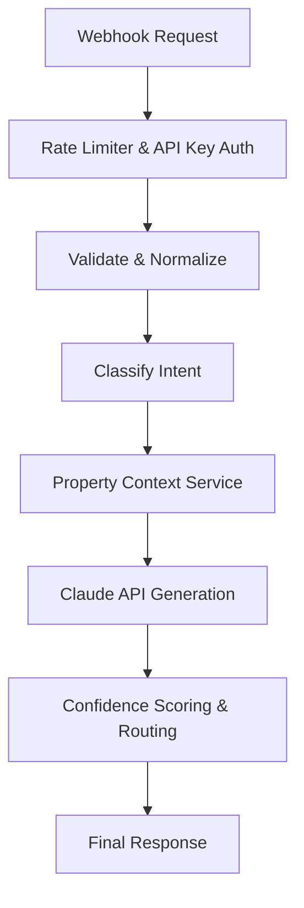

# Nistula AI-Powered Unified Guest Messaging Platform

This repository contains the backend assessment for the Nistula Summer Technology Internship 2026. It implements a centralized messaging backend that ingests guest messages from multiple channels, classifies intent, generates AI-assisted responses using Anthropic's Claude API, and implements a confidence-based routing system.

## Deployment

**Live API Deployment:**  
[https://nistula-technical-assessment-jro6.onrender.com](https://nistula-technical-assessment-jro6.onrender.com)

**Health Check Endpoint:**  
[https://nistula-technical-assessment-jro6.onrender.com/health](https://nistula-technical-assessment-jro6.onrender.com/health)

## Features

* Multi-channel guest message ingestion
* Unified message normalization
* Rule-based intent classification
* Claude AI integration using Anthropic SDK
* Confidence-based workflow routing
* Complaint escalation handling
* PostgreSQL relational schema
* API security using `x-api-key` middleware
* Rate limiting and payload protection
* Graceful fallback handling during AI/API failures
* Production-ready modular Express.js architecture

## Architecture Overview



The system follows a modular Express.js architecture:
- **Webhook Endpoint**: `POST /webhook/message` serves as the entry point for all channels (WhatsApp, Airbnb, etc.).
- **Normalization Layer**: Formats diverse payloads into a unified internal schema with unique `message_id`.
- **Classification Engine**: Rule-based intent detection categorizing messages into 6 distinct query types.
- **Claude AI Integration**: Uses `claude-sonnet-4-20250514` to draft contextual replies based on specific property policies.
- **Confidence Scoring & Routing**: Assigns a score (0 to 1) and routes the message appropriately.
- **Database (PostgreSQL)**: Robust relational schema (`schema.sql`) for tracking conversations and AI responses.

## System Flow

```plaintext
Guest Message
      ↓
Webhook Endpoint
      ↓
Validation Layer
      ↓
Normalization Engine
      ↓
Intent Classification
      ↓
Claude AI Response Generation
      ↓
Confidence Scoring
      ↓
Workflow Routing
      ↓
Final API Response
```

## Tech Stack

| Technology         | Purpose                         |
| ------------------ | ------------------------------- |
| Node.js            | Backend runtime                 |
| Express.js         | API framework                   |
| PostgreSQL         | Relational database             |
| Claude API         | AI-generated guest responses    |
| Anthropic SDK      | Claude API integration          |
| Render             | Cloud deployment                |
| express-rate-limit | API protection                  |
| dotenv             | Environment variable management |
| helmet & morgan    | HTTP security & access logging  |

## Project Structure

```plaintext
src/
├── controllers/
├── routes/
├── services/
├── config/
├── utils/
└── app.js
```

## Setup Instructions

1. **Install Dependencies**
   ```bash
   npm install
   ```

2. **Environment Configuration**
   Copy the `.env.example` file to create a `.env` file:
   ```bash
   cp .env.example .env
   ```
   Update `.env` with your Claude API key, Webhook Secret, and PostgreSQL connection URI.

3. **Database Setup**
   Run the `schema.sql` script against your PostgreSQL instance to create the necessary tables.
   ```bash
   psql -U postgres -d nistula -f schema.sql
   ```

4. **Start the Server**
   ```bash
   # Development mode with hot reload
   npm run dev
   
   # Production mode
   npm start
   ```

## API Endpoint Usage

### `POST /webhook/message`

Receives guest messages from various channels.
**Requires Header**: `x-api-key: <WEBHOOK_SECRET>`

**Example Request Payload:**
```json
{
  "source": "whatsapp",
  "guest_name": "Rahul Sharma",
  "message": "Is the villa available from April 20 to 24?",
  "timestamp": "2026-05-05T10:30:00Z",
  "booking_ref": "NIS-2024-0891",
  "property_id": "villa-b1"
}
```

**Example Response:**
```json
{
  "message_id": "123e4567-e89b-12d3-a456-426614174000",
  "query_type": "pre_sales_availability",
  "drafted_reply": "Hi Rahul! Great news — Villa B1 is available from April 20–24.",
  "confidence_score": 0.92,
  "action": "auto_send"
}
```

## Confidence Scoring Logic

The confidence score (0.0 to 1.0) dictates whether a message can be automatically handled by the AI or needs human intervention:
- **0.92** - Clear availability queries (highly deterministic).
- **0.88** - Pricing queries (moderate to high determinism).
- **0.82** - Generic informational queries (WiFi, directions).
- **0.65** - Ambiguous or very short messages.
- **0.45** - Complaints and refund requests.

*Note: Complaint-related queries are intentionally prioritized in the classification hierarchy to ensure operational issues are escalated immediately and never misclassified as informational requests.*

**Action Routing based on Score:**
- `> 0.85`: **auto_send** (No agent review needed)
- `0.60 - 0.85`: **agent_review** (Draft provided, agent must approve)
- `< 0.60`: **escalate** (Passed directly to senior staff/escalation workflow)

## Security Features

* API key protected webhook endpoint (`x-api-key`).
* The API uses `express-rate-limit` middleware to protect against abuse, spam requests, and accidental webhook loops.
* Payload size restrictions (`10kb` limit).
* Input sanitization and strict ISO-8601 validation.
* Environment variable protection using `.env`.
* Prompt injection safeguards for Claude AI.
* Graceful retry/fallback handling during API failures.
* `helmet` for automated HTTP security headers.

## Error Handling

The endpoint validates inputs thoroughly. Missing fields or invalid sources will return a `400 Bad Request`.

**Example Validation Error:**
```json
{
  "error": "Message cannot be empty"
}
```

**Example Unauthorized Error:**
```json
{
  "error": "Unauthorized"
}
```

If the Claude API fails, the system safely falls back, assigning an appropriate default message to ensure the guest isn't left hanging.

## Testing

The backend was tested against:
* Availability queries
* Pricing queries
* Complaint escalation
* Empty payload validation
* Invalid source handling
* Invalid timestamp handling
* Large payload rejection
* Rate limiting scenarios
* Claude API failure scenarios
* Security middleware validation
* Database insertion validation

All edge cases and operational scenarios passed successfully.

## Assumptions Made

- **Database Interaction in Endpoint**: Database operations are protected using structured `try-catch` handling to ensure graceful failure management and prevent silent webhook processing failures. The `schema.sql` provides the architecture.
- **Claude SDK Version**: The system uses the official `@anthropic-ai/sdk`.
- **Property Context**: The property context (Villa B1 details) is currently fetched via a dedicated `propertyService.js` to decouple it from the AI logic. In full production, this would query the database using the `property_id`.

## Future Improvements

* ML/NLP-based intent classification
* Dynamic property context retrieval from database
* Queue-based asynchronous message processing
* Real-time operational dashboard
* Slack/SMS escalation workflows
* Multilingual guest support
* AI-driven sentiment analysis
* Analytics and operational reporting

## Engineering Notes

This project was designed with a production-oriented backend engineering mindset focusing on:
* modular architecture,
* operational reliability,
* AI safety,
* graceful degradation,
* scalability,
* and maintainability.

The implementation prioritizes real-world hospitality communication workflows and safe AI-assisted automation.
