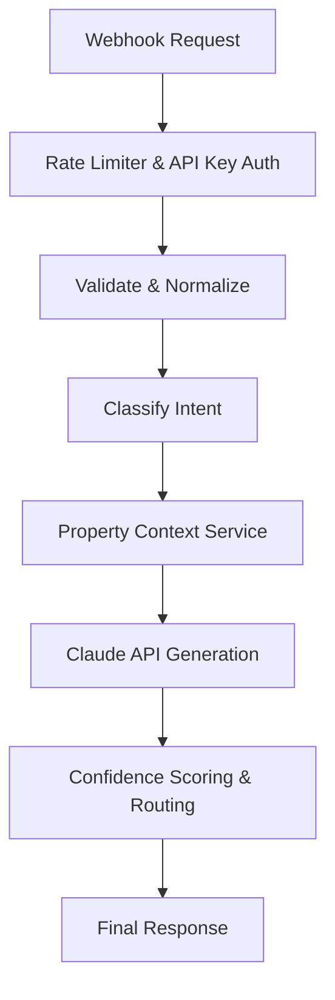

# Nistula AI-Powered Unified Guest Messaging Platform

This repository contains the backend assessment for the Nistula Summer Technology Internship 2026. It implements a centralized messaging backend that ingests guest messages from multiple channels, classifies intent, generates AI-assisted responses using Anthropic's Claude API, and implements a confidence-based routing system.

## Architecture Overview

The system follows a modular Express.js architecture:
- **Webhook Endpoint**: `POST /webhook/message` serves as the entry point for all channels (WhatsApp, Airbnb, etc.).
- **Normalization Layer**: Formats diverse payloads into a unified internal schema with unique `message_id`.
- **Classification Engine**: Rule-based intent detection categorizing messages into 6 distinct query types (e.g., `pre_sales_availability`, `complaint`).
- **Claude AI Integration**: Uses `claude-sonnet-4-20250514` (via the Anthropic SDK) to draft contextual, hospitality-focused replies based on specific property policies.
- **Confidence Scoring & Routing**: Assigns a score (0 to 1) and routes the message appropriately (`auto_send`, `agent_review`, or `escalate`).
- **Database (PostgreSQL)**: Robust relational schema (`schema.sql`) for tracking guests, reservations, conversations, messages, and AI responses.

## Prerequisites

- Node.js (v16+ recommended)
- PostgreSQL (Local or remote instance)
- Anthropic API Key

## Setup Instructions

1. **Install Dependencies**
   \`\`\`bash
   npm install
   \`\`\`

2. **Environment Configuration**
   Copy the `.env.example` file to create a `.env` file:
   \`\`\`bash
   cp .env.example .env
   \`\`\`
   Update `.env` with your Claude API key and PostgreSQL connection URI.

3. **Database Setup**
   Run the `schema.sql` script against your PostgreSQL instance to create the necessary tables.
   \`\`\`bash
   psql -U postgres -d nistula -f schema.sql
   \`\`\`

4. **Start the Server**
   \`\`\`bash
   # Development mode with hot reload
   npm run dev
   
   # Production mode
   npm start
   \`\`\`
   The server will start on `http://localhost:5000`.

## API Endpoint Usage

### `POST /webhook/message`

Receives guest messages from various channels.
**Requires Header**: `x-api-key: <WEBHOOK_SECRET>`

**Example Request Payload:**
\`\`\`json
{
  "source": "whatsapp",
  "guest_name": "Rahul Sharma",
  "message": "Is the villa available from April 20 to 24?",
  "timestamp": "2026-05-05T10:30:00Z",
  "booking_ref": "NIS-2024-0891",
  "property_id": "villa-b1"
}
\`\`\`

**Example Response:**
\`\`\`json
{
  "message_id": "123e4567-e89b-12d3-a456-426614174000",
  "query_type": "pre_sales_availability",
  "drafted_reply": "Hi Rahul! Great news — Villa B1 is available from April 20–24.",
  "confidence_score": 0.92,
  "action": "auto_send"
}
\`\`\`

## Confidence Scoring Logic

The confidence score (0.0 to 1.0) dictates whether a message can be automatically handled by the AI or needs human intervention:
- **0.92** - Clear availability queries (highly deterministic).
- **0.88** - Pricing queries (moderate to high determinism).
- **0.82** - Generic informational queries (WiFi, directions).
- **0.65** - Ambiguous or very short messages.
- **0.45** - Complaints and refund requests (always prioritized for human escalation).

**Action Routing based on Score:**
- `> 0.85`: **auto_send** (No agent review needed)
- `0.60 - 0.85`: **agent_review** (Draft provided, agent must approve)
- `< 0.60`: **escalate** (Passed directly to senior staff/escalation workflow)

## Error Handling

The endpoint validates inputs thoroughly. Missing fields or invalid sources will return a `400 Bad Request`.
\`\`\`json
{
  "error": "Invalid or unsupported source type"
}
\`\`\`
If the Claude API fails, the system safely falls back, assigning an appropriate default message to ensure the guest isn't left hanging.

## Assumptions Made

- **Database Interaction in Endpoint**: For the sake of demonstration without a guaranteed DB connection on the evaluator's machine, the actual database insert statements in `messageController.js` are wrapped in a `try-catch` and currently logged out. The `schema.sql` provides the architecture.
- **Claude SDK Version**: The system uses the official `@anthropic-ai/sdk`.
- **Property Context**: The property context (Villa B1 details) is currently hardcoded into the `claudeService.js` prompt. In production, this would be fetched dynamically from the database using the `property_id` provided in the payload.
